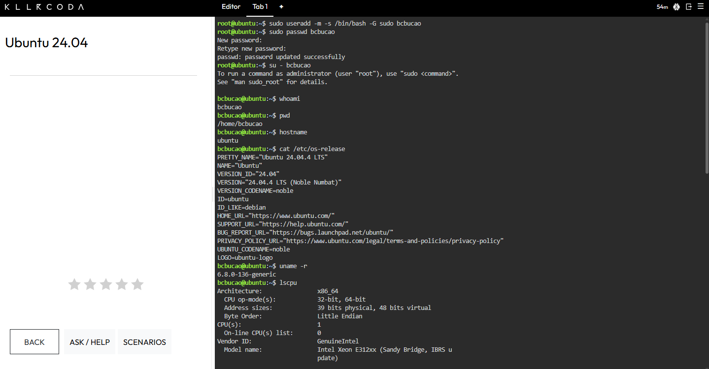
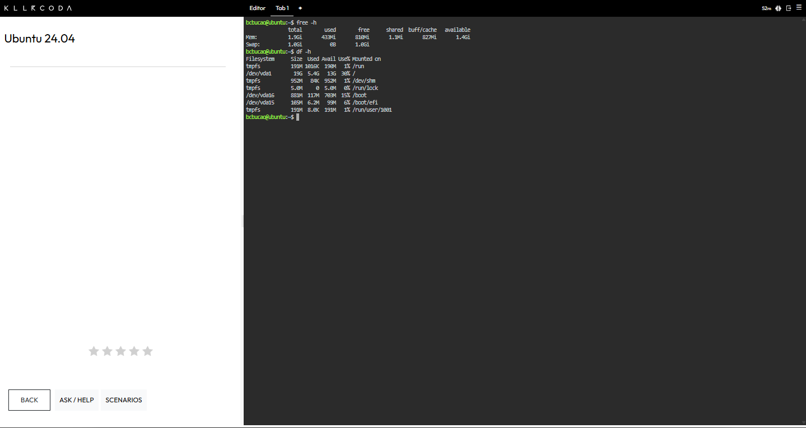

# Laboratory Activity 3: Become a Multi-Cloud Explorer

> *CCM101 – Cloud Computing Laboratory Activity*

---

## Student Information
- **Name**: Bryx
- **Course/Section**: CCM-4A
- **Instructor**: JENKIELYN CORTEZ TORRES
- **School Year**: 2026-2027

---

## Mission Overview
A new client plans to migrate its existing IT infrastructure to the cloud. However, the client is unsure whether to adopt Amazon Web Services (AWS), Microsoft Azure, or Google Cloud Platform (GCP).

As part of the Cloud Evaluation Team at **CloudNova Technologies**, the mission is to explore these leading cloud platforms, compare their core services, and recommend the best solutions for different client business scenarios.

---

## Expected Repository Structure
```text
activities/laboratory 3/
├── README.md
├── aws-research.md
├── azure-research.md
├── gcp-research.md
├── cloud-platform-comparison.md
├── client-recommendations.md
├── reflection.md
├── killer_coda_guide.md
└── screenshots/
    ├── aws-homepage.png
    ├── azure-homepage.png
    ├── gcp-homepage.png
    ├── killercoda-terminal.png
    └── github-repository.png
```

---

## Checkpoint 7: Linux Investigation (KillerCoda)
Below is the system information gathered from the KillerCoda Ubuntu Linux environment.

### System Information Table
| Specification | Value / Output | Command Used |
| :--- | :--- | :--- |
| **Operating System** | Ubuntu 24.04.4 LTS (Noble Numbat) | `lsb_release -a` or `cat /etc/os-release` |
| **Kernel Version** | 6.8.0-136-generic | `uname -r` |
| **CPU Information** | Intel Xeon E312xx (Sandy Bridge) | `lscpu` or `cat /proc/cpuinfo` |
| **Total Memory** | 1.9Gi | `free -h` |
| **Disk Space** | 13Gi available (19Gi total) | `df -h /` |

---

### Cloud Migration Recommendations
If this Linux server were migrated to the cloud, the following services from AWS, Azure, and GCP could host it:

*   **Amazon Web Services (AWS)**: 
    *   *Service*: Amazon EC2 (Elastic Compute Cloud)
    *   *Description*: Provides resizable compute capacity in the cloud as virtual servers (instances).
*   **Microsoft Azure**: 
    *   *Service*: Azure Virtual Machines
    *   *Description*: On-demand, scalable computing resources that offer the flexibility of virtualization.
*   **Google Cloud Platform (GCP)**: 
    *   *Service*: Google Compute Engine (GCE)
    *   *Description*: Delivers virtual machines running in Google's innovative data centers and worldwide network.

---

## Screenshots Evidence


