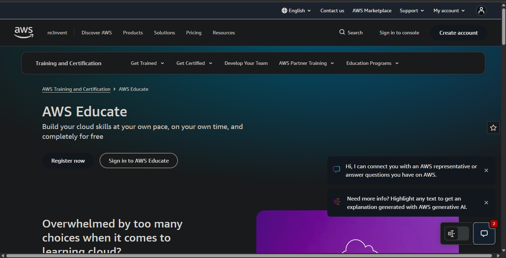

# AWS Cloud Platform Research

## 1. Brief Overview
Amazon Web Services (AWS) is the world's most comprehensive and broadly adopted cloud platform, offering over 200 fully featured services from data centers globally. It was officially launched in 2006 and is used by millions of customers worldwide.

---

## 2. Global Infrastructure
- **Regions**: AWS operates dozens of geographic regions across the Americas, Europe, Asia Pacific, and the Middle East.
- **Availability Zones (AZs)**: Each region contains multiple isolated, physically separate Availability Zones connected with low latency.
- **Edge Locations**: Used for caching content closer to users via Amazon CloudFront CDN.

---

## 3. Cloud Management Console
The AWS Management Console is a web-based portal where users can access, manage, and monitor all AWS services. AWS also provides AWS Educate, a free learning program for students to build cloud skills.

---

## 4. Core Services (4)
1. **Compute**: **Amazon EC2** - Scalable virtual servers in the cloud.
2. **Storage**: **Amazon S3** - Object storage for any amount of data from anywhere.
3. **Database**: **Amazon RDS** - Managed relational database service supporting multiple engines.
4. **Networking**: **Amazon VPC** - Logically isolated private network within AWS.

---

## 5. Advantages (3)
1. **Broadest Service Catalog**: AWS offers the widest range of services of any cloud provider, making it highly versatile.
2. **Global Reach**: It has the largest global footprint of regions and availability zones.
3. **Maturity and Reliability**: As the oldest major cloud platform, AWS has a proven track record of stability and security.

---

## 6. Typical Enterprise Use Cases
- Hosting large-scale web applications and APIs.
- Data analytics, machine learning, and big data processing.
- Enterprise backup, disaster recovery, and storage archiving.
