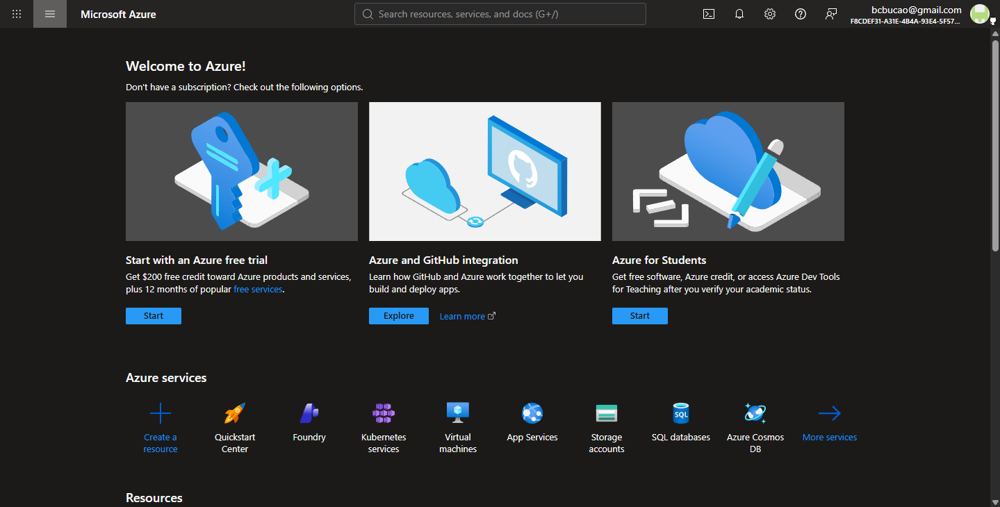

# Microsoft Azure Cloud Platform Research

## 1. Brief Overview
Microsoft Azure is a cloud computing platform operated by Microsoft, offering access to a broad set of cloud services including computing, analytics, storage, and networking. It was launched in 2010 and is especially popular among enterprises already using Microsoft products.

---

## 2. Global Infrastructure
- **Regions**: Azure has more global regions than any other cloud provider, serving over 60 regions worldwide.
- **Availability Zones**: Each region contains multiple isolated datacenters for high availability.
- **Azure Arc**: Enables extending Azure management and services to any environment, including on-premises.

---

## 3. Cloud Management Console
The Azure Portal is a unified web-based console for building, managing, and monitoring cloud deployments. It offers quick access to services like Virtual Machines, Kubernetes, App Services, SQL Databases, and more. Azure also offers free trials and student benefits.

---

## 4. Core Services (4)
1. **Compute**: **Azure Virtual Machines** - Scalable Linux and Windows virtual machines.
2. **Storage**: **Azure Blob Storage** - Massively scalable object storage for unstructured data.
3. **Database**: **Azure SQL Database** - Fully managed relational database built on SQL Server.
4. **Networking**: **Azure Virtual Network (VNet)** - Private network infrastructure in Azure.

---

## 5. Advantages (3)
1. **Microsoft Ecosystem Integration**: Seamlessly connects with Active Directory, Windows Server, Microsoft 365, and SQL Server.
2. **Hybrid Cloud Leader**: Azure Arc and Azure Stack provide the strongest hybrid cloud capabilities available.
3. **Enterprise Trust**: Widely adopted in enterprise environments due to existing Microsoft licensing and compliance tools.

---

## 6. Typical Enterprise Use Cases
- Migrating existing Windows Server workloads to the cloud.
- Hosting enterprise applications using .NET and Azure App Services.
- Centralized identity management using Microsoft Entra ID (formerly Azure AD).
