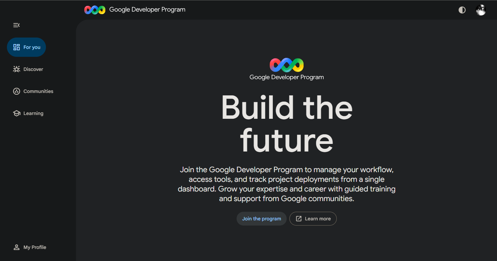

# Google Cloud Platform (GCP) Research

## 1. Brief Overview
Google Cloud Platform (GCP) is a suite of cloud computing services provided by Google, running on the same infrastructure used internally for products like Google Search, YouTube, and Gmail. It was made publicly available in 2008 and is known for its strength in data analytics and AI.

---

## 2. Global Infrastructure
- **Regions and Zones**: GCP operates across multiple regions and zones globally.
- **Google Global Network**: Traffic runs on Google's private fiber-optic network for high speed and low latency.
- **Google Developer Program**: Offers tools and resources for developers to deploy and manage projects from a centralized dashboard.

---

## 3. Cloud Management Console
The Google Cloud Console is a web interface for managing GCP resources. Google also operates the Google Developer Program, which provides a unified dashboard for workflow management, tool access, and project deployment tracking.

---

## 4. Core Services (4)
1. **Compute**: **Google Compute Engine (GCE)** - High-performance virtual machines.
2. **Storage**: **Google Cloud Storage (GCS)** - Scalable and durable object storage.
3. **Database**: **Cloud SQL** - Managed MySQL, PostgreSQL, and SQL Server databases.
4. **Networking**: **Cloud VPC** - Global virtual private cloud network.

---

## 5. Advantages (3)
1. **AI and Machine Learning Leader**: GCP provides state-of-the-art AI tools including Vertex AI and Cloud TPUs.
2. **Best-in-Class Kubernetes**: As the original developer of Kubernetes, Google Kubernetes Engine (GKE) is the most mature managed Kubernetes platform.
3. **High-Performance Network**: Google's private global fiber network delivers consistent low-latency performance worldwide.

---

## 6. Typical Enterprise Use Cases
- Big data processing and real-time analytics using BigQuery.
- Training and deploying machine learning models with Vertex AI.
- Running containerized applications and microservices on GKE.
